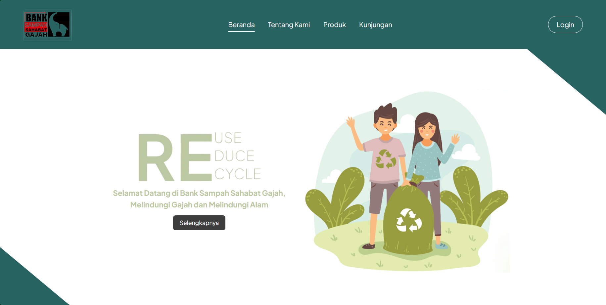
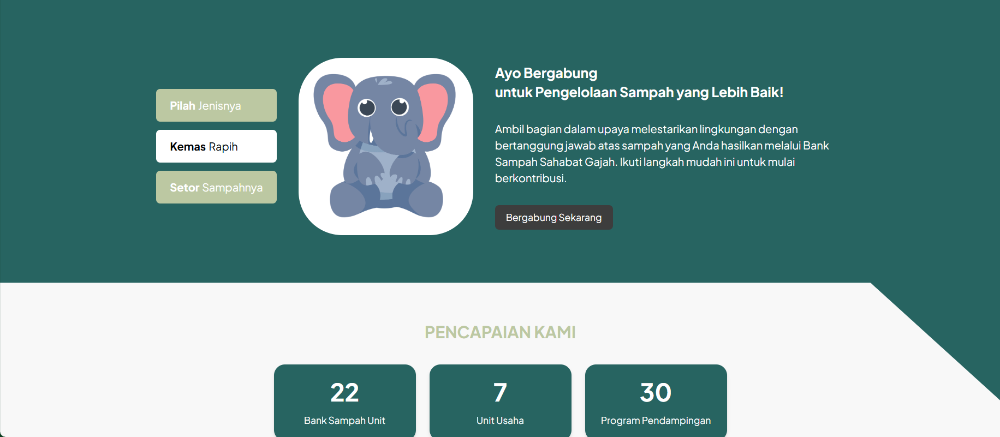
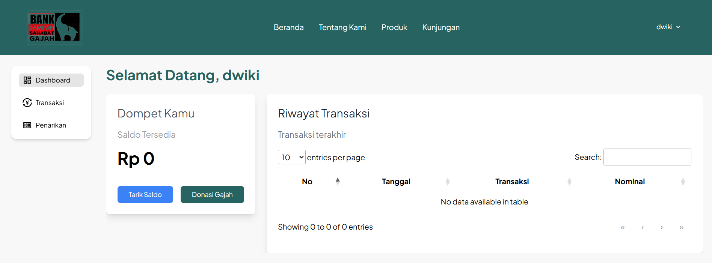
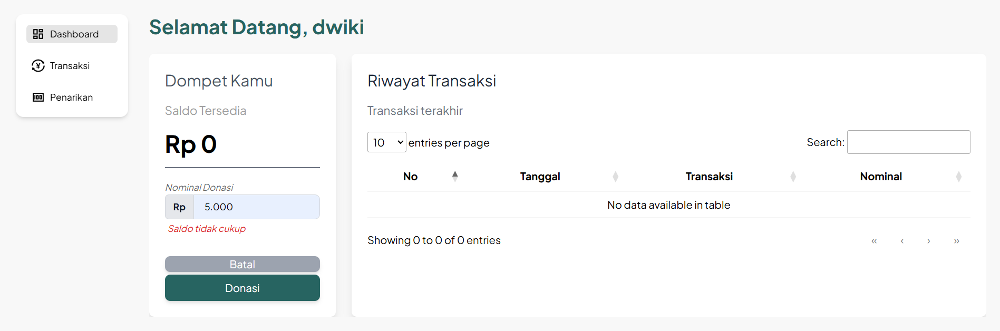
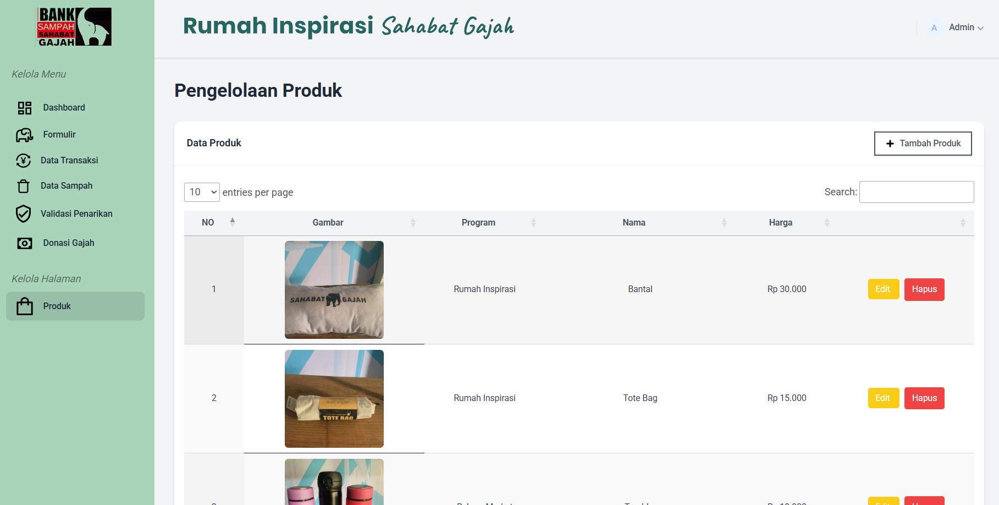

# Bank Sampah
Trash/waste management website created to help PT. Bank Sampah Sahabat Gajah to organize business processes in the waste-to-money management business 

## Features

- Dashboard Users with history transaction, donation to elephant, balance, withdraw balance.
- Withdrawing balance and Historical data
- Users be able to donate to elephant easily
- Content Management System (CMS) for product
- Historical users transaction in the admin section
- Admin can manage all the data related to the business
- Transaction aprovals and input data transaction from users
- Donation report

## Tech Stack

- Frontend  : [Blade](https://laravel.com/docs/12.x/blade#main-content), [Alpine js](https://alpinejs.dev/), [Tailwindcss](https://tailwindcss.com/)
- Backend   : [Laravel](https://laravel.com/), [Laravel Sactum](https://laravel.com/docs/12.x/sanctum#installation)
- Database  : [Postgresql](https://www.postgresql.org/)
- Hosting   : [Hostinger](https://www.hostinger.com/id)
- CI/CD     : [Github Actions](https://docs.github.com/en/actions)

## Instalation

### Prerequisite
- ``Composer 2.8.8`` or **Latest version**
- ``Node 22.15`` or **Latest version**
- ``Postgresql 17.5`` or **Latest version**
- ``PHP 8.3.16``, enable __pdo_pgsql__ extension at `php.ini` file


### Installation Steps
1.  Clone this repository : 
     ```bash
     git clone https://github.com/1wikii/BankSampah.git
     ```
2.  Enter _Bank Sampah_ directory : 
    ```bash
    $ cd BankSampah
    ```
3.  Copy ``.env.example`` to ``.env``, or you can use this command below :
    ```bash
    $ cp .env.example .env
    ```
4.  Install the dependencies :
    ```bash
    $ composer install-all
    ```
5.  Generate key :
    ```bash
    $ php artisan key:generate
    ```
6.  Prepare your `postgresql` server and setup config `.env`:
    ```bash
    DB_CONNECTION=pgsql
    DB_HOST=localhost
    DB_PORT=5432
    DB_DATABASE=YOUR_DATABASE_NAME
    DB_USERNAME=root
    DB_PASSWORD=
    ```
7.  Run database migrations and seeders :
    ```bash
    $ php artisan migrate --seed
    ```
8.  Run both server :
    ```bash
    $ php artisan serve
    ```
    and
    ```bash
    $ npm run dev
    ```
9.  Open http://localhost:8000/, Admin credentials : 
    ```bash
    Email       : admin@admin.com
    Password    : admin.123
    ```

## Screenshots

<div style="display: flex; flex-direction: column; justify-content: center; align-items:center;">
<div style="font-weight: bold; margin: 20px 0 5px 0;">Main Page</div>
    
    

<div style="font-weight: bold; margin: 40px 0 5px 0;">User Dashboard</div>
    

<div style="font-weight: bold; margin: 40px 0 5px 0;">User Donation</div>
    

<div style="font-weight: bold; margin: 40px 0 5px 0;">Admin Product Page</div>
    
</div>
